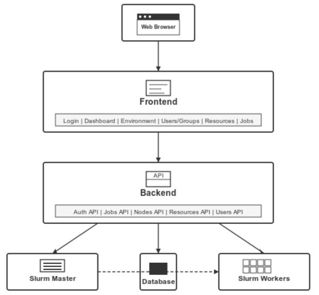

# HPC-Slurm-Hex

A GUI layer for SLURM, transforming traditional CLI-based SLURM into an intuitive web interface. Works seamlessly with pre-installed SLURM, requiring no removal or reconfiguration. Deployed as three independent modules: Master, Worker, and Frontend.

## Key Features

- **GUI for SLURM**: Manage jobs, users, and resources via a web dashboard.
- **Modular Deployment**: Deploy Master, Worker, and Frontend separately.
- **No SLURM Overhaul**: Enhances preconfigured SLURM without replacing it.
- **Admin Dashboard**: Control user/group management, resource allocation, and job CRUD operations.
- **Scalable**: Connect multiple worker nodes and manage via the Frontend.

## Architecture

HPC-Slurm-Hex consists of three modules:

- **HPC-Slurm-Master**: Central management node (Node.js, Redis).
- **HPC-Slurm-Worker**: Worker nodes for job execution (Python).
- **HPC-Slurm-Frontend**: Web interface for admin/user interaction (Docker).



## Quick Setup Guide

### 1. HPC-Slurm-Master (Deploy on Master Node)

- Download `HPC-Slurm-Master.zip` from the latest release.
- Prerequisites: Node.js, Redis (running on port 6379).
- Navigate to the directory, run:

  ```bash
  npm install
  npm start
  ```
- Runs on port 5050. Keep it running.

### 2. HPC-Slurm-Worker (Deploy on Worker Nodes)

- Download `HPC-Slurm-Worker.zip` from the latest release.
- Prerequisite: Python 3.
- Navigate to the directory, run:

  ```bash
  pip install -r requirements.txt
  python3 app.py
  ```
- Runs on port 5050. Keep it running.

### 3. HPC-Slurm-Frontend (Deploy on Admin/User Machine)

- Prerequisite: Docker engine.
- Download `docker-compose.yaml` from the latest release.
- Run:

  ```bash
  docker compose up
  ```
- Visit `localhost:5051`, set up the admin user, and access the dashboard.
- Connect Master/Worker nodes:
  - Go to "Environment" in the sidebar.
  - Add Master node’s public IP and connect.
  - Add Worker nodes’ public IPs (specify quantity, e.g., 2) and connect.
- Manage users, groups, resources, and jobs via the sidebar.


## Contributions welcome! Feel free to open issues or PRs.
