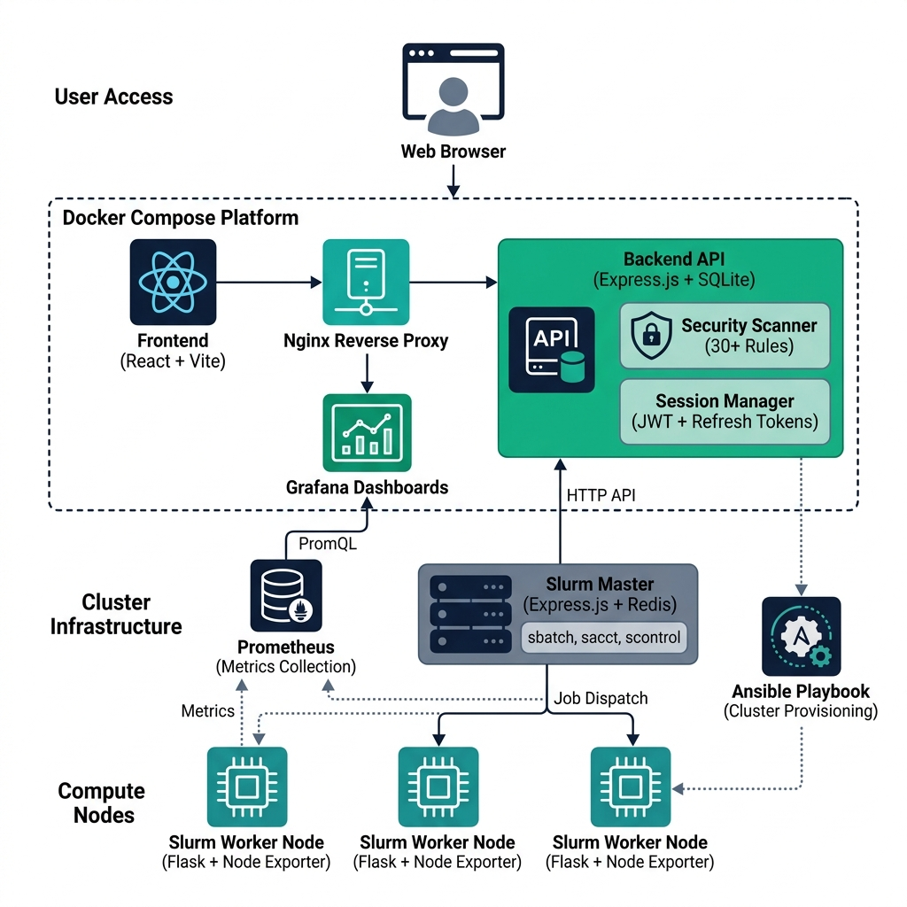
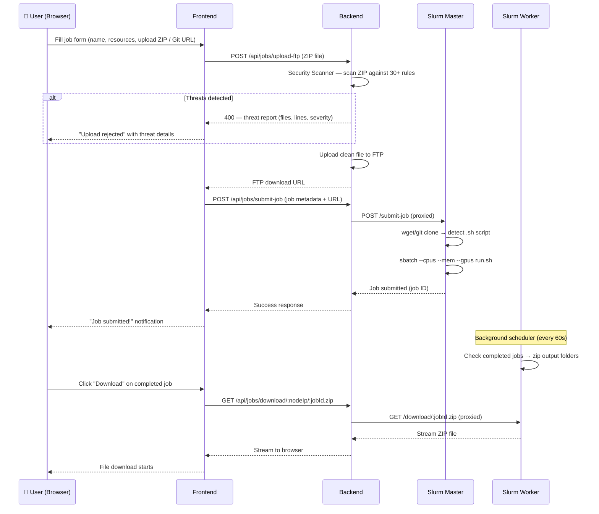

<h1 align="center">HPC-Slurm-Hex</h1>

<p align="center">
  <strong>A Web-Based GUI & Automation Layer for SLURM-Managed HPC Clusters</strong>
</p>
<p align="center">
  
</p>

---

## 📌 Problem Statement

[SLURM (Simple Linux Utility for Resource Management)](https://slurm.schedmd.com/) is the industry-standard workload manager for High-Performance Computing (HPC) clusters. However, it is **entirely CLI-based**, which creates two significant pain points:

| Persona | Pain Point |
|---------|-----------|
| **HPC Administrators** | Setting up and configuring a multi-node SLURM cluster from scratch involves dozens of manual steps — installing packages, distributing configuration files, managing munge keys, and synchronizing services across every node. This process is error-prone and time-consuming. |
| **HPC Users (Researchers, Students, Engineers)** | Submitting, monitoring, and downloading results of computational jobs requires memorizing `sbatch`, `squeue`, `sacct`, and `scancel` commands, writing batch scripts by hand, and SSHing into nodes to retrieve output files. |

**HPC-Slurm-Hex** eliminates both pain points by providing:

1. **An Ansible-based automation playbook** that provisions and configures a complete OpenHPC + SLURM cluster (master + N workers) with a single command.
2. **A modern web GUI** where administrators manage users, groups, resource quotas, and node environments — and users submit jobs, track status, and download results — all from a browser with **zero CLI interaction**.

> **Key Principle:** HPC-Slurm-Hex is a *complement*, not a replacement. It layers on top of an existing (or freshly provisioned) SLURM installation and works seamlessly without any reconfiguration of SLURM itself.

---

## ✨ Features

### For Administrators
- 🖥️ **One-Command Cluster Provisioning** — Ansible playbook installs OpenHPC, SLURM, MPI stacks, compilers, and performance tools on master + worker nodes automatically.
- 👥 **User & Group Management** — Create, update, and delete users via the dashboard. Users receive their credentials by email automatically.
- 🔐 **Role-Based Access Control (RBAC)** — Admin and user roles with group-based, per-tab permissions (Dashboard, Jobs, Users, Resources, Environment, Settings).
- 📊 **Resource Quota Enforcement** — Set per-user or per-group CPU, GPU, and memory limits.
- 🌐 **Environment (Node) Management** — Connect/disconnect master and worker nodes, view real-time Slurm node status (CPU load, memory, partitions, GRES).
- ✉️ **Email Notifications** — Welcome emails on user creation; SLURM `--mail-type` notifications for job BEGIN, END, and FAIL events.
- 📈 **Real-Time Resource Monitoring** — Live CPU, memory, and GPU utilization graphs powered by Prometheus + Grafana, with per-node filtering and configurable refresh rates.
- 📥 **Job History CSV Export** — Export filtered job history (24h / 7d / 30d / 90d / all) as CSV files for reporting and auditing.

### For Users
- 📤 **Browser-Based Job Submission** — Upload a ZIP file or provide a Git repository URL; the system clones/extracts, detects the shell script (`run.sh`, `main.sh`, etc.), and submits via `sbatch` automatically.
- 📋 **Job Dashboard** — View all jobs with status (Running, Completed, Failed, Cancelled), CPU/GPU/memory allocation, start/end times, and exit codes.
- ⬇️ **One-Click Result Download** — Completed job directories are automatically zipped on worker nodes and served via download links through the web interface.
- ❌ **Job Cancellation** — Cancel running jobs directly from the GUI.
- ⚙️ **Profile Settings** — Change password, update email, and manage personal preferences.

### Security & Session Management
- 🛡️ **Malicious Code Scanning** — Every uploaded ZIP file is scanned against 30+ security rules before job submission. Detects reverse shells, crypto miners, fork bombs, privilege escalation, exploit frameworks, YAML deserialization attacks, and more. Malicious uploads are automatically rejected with detailed threat reports.
- 🔑 **Secure Session Management** — JWT access tokens (15 min TTL) with rotating httpOnly refresh tokens stored in SQLite. Supports idle timeout (30 min), absolute session lifetime (12 hr), multi-device sessions, and automatic token reuse detection.
- 🚪 **Session Lifecycle** — Login creates an independent session per device; `/refresh` rotates tokens; `/logout` revokes current session; `/logout-all` revokes all sessions for a user.
- 🔍 **Cross-Tab Idle Detection** — Frontend tracks user activity across browser tabs; warns before idle timeout and forces logout on expiry.

---

## 🏗️ Architecture

HPC-Slurm-Hex consists of multiple independently deployable modules organized into four layers:

```
┌──────────────────────────────────────────────────────────────────┐
│                          Web Browser                            │
└──────────────────────────────┬───────────────────────────────────┘
                               │
┌──────────────────────────────▼───────────────────────────────────┐
│                       hpc-slurm-gui  (Docker Compose)           │
│                                                                 │
│  ┌──────────────┐  ┌─────────────┐  ┌────────────────────────┐  │
│  │   Frontend   │  │   Nginx     │  │       Backend          │  │
│  │  (React +    │◄─┤  Reverse    │  │  (Express.js + SQLite  │  │
│  │   Vite)      │  │   Proxy     │──►  JWT + Session Mgmt   │  │
│  └──────────────┘  └──────┬──────┘  │  Security Scanner)     │  │
│                           │         └───────────┬────────────┘  │
│  ┌──────────────┐         │                     │               │
│  │   Grafana    │◄────────┘                     │               │
│  │  (Dashboards)│                               │               │
│  └──────┬───────┘                               │               │
└─────────┼───────────────────────────────────────┼───────────────┘
          │                                       │ HTTP API
          │ PromQL                                │
┌─────────▼──────────┐   ┌────────────────────────▼───────────────┐
│     Prometheus     │   │            slurm-master               │
│  (Metrics Server)  │   │       (Express.js + Redis)             │
│  Node / SLURM /    │   │     Runs on SLURM controller node     │
│  DCGM Exporters    │   └───────────┬─────────────┬─────────────┘
└────────────────────┘               │             │
                          sbatch / sacct      HTTP proxy
                          scontrol           to workers
                                     │             │
                    ┌────────────────▼──┐   ┌──────▼───────────┐
                    │   slurm-worker    │   │   slurm-worker   │
                    │ (Flask + APSched) │   │ (Flask + APSched)│
                    │  + Node Exporter  │   │  + Node Exporter │
                    └───────────────────┘   └──────────────────┘
```

### Module Breakdown

| Module | Stack | Purpose | Port |
|--------|-------|---------|------|
| **Frontend** | React 19, Vite, MUI, Lucide Icons, SweetAlert2 | Web dashboard for admins and users | `5051` |
| **Backend** | Express.js, Sequelize (SQLite), JWT, Nodemailer, Multer | REST API, authentication, user/group/resource management, FTP file upload | `5052` |
| **Nginx Proxy** | Nginx (Docker) | Reverse proxy unifying frontend + backend under a single port | `5051` (public) |
| **Slurm Master** | Express.js, Redis | API layer on the SLURM controller — executes `sbatch`, `sacct`, `scontrol`, caches job data in Redis | `5053` |
| **Slurm Worker** | Flask, APScheduler | Lightweight API on each compute node — handles job submission, health checks, result zipping & download | `5053` |
| **Ansible** | Ansible Playbook (YAML) | Automated OpenHPC + SLURM cluster provisioning for master and worker nodes | N/A |
| **Grafana** | Grafana (Docker) | Real-time resource monitoring dashboards for CPU, memory, GPU, and SLURM job metrics | `3000` |
| **Prometheus** | Prometheus + Node Exporter + SLURM Exporter + DCGM Exporter | Metrics collection from all cluster nodes; provisioned via Ansible | `9090` |
| **Security Scanner** | AdmZip + custom rule engine | Pre-submission malicious code scanning with 30+ threat detection rules | N/A |

---

## 📁 Repository Structure

```
HPC-Slurm-Hex/
├── ansible/                           # Cluster provisioning automation
│   ├── input.yml                      # Configurable cluster variables (IPs, hostnames, feature flags)
│   ├── inventory.yml                  # Ansible inventory (master + workers)
│   ├── playbook.yml                   # Full OpenHPC + SLURM + monitoring installation playbook
│   ├── vault.yml                      # Encrypted sensitive variables
│   └── templates/                     # Systemd service templates for monitoring
│       ├── node-exporter.service.j2   # Node Exporter (system metrics per node)
│       ├── prometheus.service.j2      # Prometheus server service
│       ├── prometheus.yml.j2          # Prometheus scrape config (nodes, SLURM, DCGM)
│       └── slurm-exporter.service.j2  # SLURM job/queue exporter
│
├── hpc-slurm-gui/                     # Web GUI (Dockerized)
│   ├── docker-compose.yaml            # Orchestrates frontend, backend, Nginx, and Grafana
│   ├── nginx.conf                     # Reverse proxy (frontend, backend, /grafana/)
│   ├── grafana/                       # Grafana provisioning
│   │   └── provisioning/
│   │       ├── dashboards/slurm.json  # Pre-built SLURM cluster monitoring dashboard
│   │       └── datasources/prometheus.yml # Prometheus data source config
│   ├── frontend/                      # React + Vite SPA
│   │   └── src/
│   │       ├── api/client.js               # Axios client with auth interceptors & token refresh
│   │       ├── auth/authStore.js            # Centralized auth state management
│   │       ├── sessionPolicy.js             # Frontend session policy (TTL, idle, cross-tab)
│   │       ├── components/
│   │       │   ├── AdminSetup.jsx            # First-time admin registration
│   │       │   ├── Login.jsx                 # Authentication page with session support
│   │       │   ├── Home.jsx                  # Main layout shell with idle detection
│   │       │   ├── Sidebar.jsx               # Permission-aware navigation
│   │       │   ├── Dashboard.jsx             # Job statistics and quick actions
│   │       │   ├── JobsPage.jsx              # Job submission, security scan feedback, CSV export
│   │       │   ├── UserGroup.jsx             # User & group CRUD, group membership
│   │       │   ├── ResourceAllocation.jsx    # Quotas + real-time CPU/memory/GPU graphs
│   │       │   ├── RemoteNodes.jsx           # Connect/disconnect master and worker nodes
│   │       │   └── Settings.jsx              # Profile management
│   │       └── tests/                        # Jest + React Testing Library tests
│   │
│   └── backend/                       # Express.js REST API
│       ├── config/
│       │   ├── db.js                  # Sequelize models (User, Group, Node, ResourceLimit, Session)
│       │   └── sessionPolicy.js       # Session TTL / idle / absolute lifetime policy
│       ├── middleware/auth.js         # JWT + session validation middleware
│       ├── routes/
│       │   ├── auth.js                # Login, signup, refresh, logout, logout-all, session-policy
│       │   ├── users.js               # User/group CRUD, permissions
│       │   ├── jobs.js                # Job proxy, FTP upload, security scan, CSV export
│       │   ├── nodes.js               # Node connection and Slurm node status
│       │   ├── resources.js           # Resource limit CRUD + Prometheus metrics proxy
│       │   └── email.js               # Email notification endpoints
│       ├── services/
│       │   ├── emailService.js        # Nodemailer SMTP integration
│       │   ├── securityScanner.js     # ZIP malware scanning engine (30+ rules)
│       │   └── sessionService.js      # Token signing, refresh rotation, session lifecycle
│       ├── templates/welcomeEmail.js  # HTML email template
│       ├── utils/passwordGenerator.js # Secure password generation
│       └── tests/                     # Jest + Supertest API tests
│
├── slurm-master/                      # Slurm controller API agent
│   ├── server.js                      # Express API wrapping sbatch, sacct, scontrol
│   ├── package.json                   # Dependencies (express, redis, axios, uuid)
│   └── .env                           # Port, FTP credentials, webserver URL
│
├── slurm-worker/                      # Compute node API agent
│   ├── app.py                         # Flask API for job submission, download, health checks
│   ├── requirements.txt               # Dependencies (Flask, APScheduler, requests)
│   └── .env                           # FTP credentials
│
├── assets/                            # Documentation assets
│   └── arch.png                       # Architecture diagram
├── LICENSE                            # GNU GPLv3
└── README.md                          # ← You are here
```

---

## 🚀 Quick Start

### Prerequisites

| Component | Required Software |
|-----------|------------------|
| **Slurm Master Node** | Node.js ≥ 18, Redis Server, SLURM (pre-installed) |
| **Slurm Worker Nodes** | Python ≥ 3.8, SLURM Client (pre-installed) |
| **GUI (Admin/User Machine)** | Docker Engine + Docker Compose |
| **Ansible Provisioning** | Ansible ≥ 2.9, SSH access to all nodes |

---

### Option A: Automated Cluster Setup (Ansible)

If you're starting from bare metal or fresh VMs, use the Ansible playbook to provision the entire OpenHPC + SLURM stack:

1. **Edit cluster variables:**
   ```bash
   vim ansible/input.yml
   ```
   Configure hostnames, IP addresses, MAC addresses, feature flags (InfiniBand, GPU drivers, MPI stacks, etc.).

2. **Update inventory:**
   ```bash
   vim ansible/inventory.yml
   ```
   Add your master and worker node IPs with SSH credentials.

3. **Run the playbook:**
   ```bash
   cd ansible
   ansible-playbook -i inventory.yml playbook.yml --ask-vault-pass
   ```
   This will:
   - Install OpenHPC packages and SLURM on the master
   - Configure NTP, munge, slurmctld, rsyslog, and NHC
   - Install GNU compilers, OpenMPI, MPICH, performance tools, and scientific libraries
   - Deploy SLURM client + munge on all worker nodes
   - Start all necessary services

---

### Option B: Manual Setup (Deploy on an existing SLURM cluster)

#### 1️⃣ Deploy Slurm Master API (on the SLURM controller node)

```bash
# Download or clone the slurm-master directory to the master node
cd slurm-master

# Configure environment
cp .env.example .env   # or edit .env directly
# Set PORT, FTP credentials, and WEBSERVER_URL

# Install dependencies and start
npm install
npm start
```

The master API will start on the configured port (default: `5053`). **Keep this running.**

#### 2️⃣ Deploy Slurm Worker API (on each compute node)

```bash
# Download or clone the slurm-worker directory to each worker node
cd slurm-worker

# Install dependencies and start
pip install -r requirements.txt
python3 app.py
```

The worker API will start on port `5053`. **Keep this running on every compute node.**

#### 3️⃣ Deploy the Web GUI (on any machine with Docker)

```bash
# Download or clone the hpc-slurm-gui directory
cd hpc-slurm-gui

# Configure backend environment
vim backend/.env
# Set JWT_SECRET, SLURM_PORT, email settings, and CORS_ORIGIN

# Start all services
docker compose up -d
```

The GUI will be available at **`http://localhost:5051`**.

#### 4️⃣ Initial Configuration

1. Visit `http://localhost:5051` — you'll be prompted to **create the admin account**.
2. Log in with the admin credentials.
3. Navigate to **Environment** in the sidebar:
   - Add the **Master node** IP and connect.
   - Add each **Worker node** IP and connect.
4. Navigate to **Users/Groups** to create users and assign groups.
5. Navigate to **Resource Allocation** to set CPU/GPU/memory quotas.
6. Users can now log in and submit jobs from the **Jobs** page.

---

## 🔌 API Reference

### Backend API (Port 5052)

| Method | Endpoint | Description |
|--------|----------|-------------|
| `GET` | `/api/auth/check-admin` | Check if an admin account exists |
| `POST` | `/api/auth/setup-admin` | Create the first admin user |
| `POST` | `/api/auth/login` | Authenticate; returns access token + sets refresh cookie |
| `POST` | `/api/auth/refresh` | Rotate refresh token and issue new access token |
| `POST` | `/api/auth/logout` | Revoke current session |
| `POST` | `/api/auth/logout-all` | Revoke all sessions for user |
| `GET` | `/api/auth/me` | Get authenticated user profile |
| `GET` | `/api/auth/session-policy` | Get session TTL configuration |
| `POST` | `/api/auth/signup` | Create a new user (admin only) |
| `GET` | `/api/users/users` | List all users |
| `PUT` | `/api/users/users/:id` | Update a user |
| `DELETE` | `/api/users/users/:id` | Delete a user |
| `GET/POST/PUT/DELETE` | `/api/users/groups` | CRUD operations on groups |
| `POST/DELETE` | `/api/users/user-groups` | Manage group membership |
| `GET` | `/api/users/users/:userId/permissions` | Get effective permissions for a user |
| `GET/POST/DELETE` | `/api/resources/resource-limits` | CRUD for resource quotas |
| `GET` | `/api/resources/metrics` | Real-time CPU/memory/GPU metrics from Prometheus |
| `POST` | `/api/nodes/connect` | Connect a master or worker node |
| `GET` | `/api/nodes/get-nodes-list` | List all connected nodes |
| `GET` | `/api/nodes/slurm-nodes` | Get real-time Slurm node status |
| `POST` | `/api/jobs/upload-ftp` | Upload ZIP file (with security scan) |
| `GET` | `/api/jobs/slurm-jobs` | List all jobs (proxied from master) |
| `POST` | `/api/jobs/submit-job` | Submit a job (proxied to master) |
| `POST` | `/api/jobs/cancel-job` | Cancel a running job |
| `GET` | `/api/jobs/export-csv` | Export job history as CSV (admin only) |
| `GET` | `/api/jobs/download/:nodeIp/:filename` | Download job results from a worker |

### Slurm Master API (Port 5053)

| Method | Endpoint | Description |
|--------|----------|-------------|
| `GET` | `/connect` | Health check and system info |
| `GET` | `/jobs` | List all jobs via `sacct` (Redis-cached, 3s TTL) |
| `GET` | `/job-status/:jobId` | Get status of a specific job |
| `GET` | `/next-job-id` | Get the next available job ID |
| `POST` | `/submit-job` | Submit a job via `sbatch` |
| `POST` | `/cancel-job` | Cancel a job via `scancel` |
| `GET` | `/job-ip/:jobId` | Get IP address of the node running a job |
| `GET` | `/nodes` | Get Slurm node info via `scontrol` |
| `GET` | `/worker-connect/:ip` | Proxy health check to a worker node |

### Slurm Worker API (Port 5053)

| Method | Endpoint | Description |
|--------|----------|-------------|
| `GET` | `/connect` | Health check (CPU, GPU, memory info) |
| `POST` | `/submit-job` | Submit a job locally via `sbatch` |
| `POST` | `/cancel-job` | Cancel a job via `scancel` |
| `GET` | `/download/<job_id>.zip` | Download zipped job results |

---

## 🧪 Testing

The project includes test suites for both the backend and frontend:

### Backend Tests (Jest + Supertest)
```bash
cd hpc-slurm-gui/backend
npm test
```
Tests cover: `auth`, `email`, `nodes`, `resources`, `users`, `sessionService`, `sessionPolicy`, `sessionStore`, `phase4.e2e`

### Frontend Tests (Jest + React Testing Library)
```bash
cd hpc-slurm-gui/frontend
npm test
```
Tests cover: `AdminSetup`, `Dashboard`, `Home`, `JobsPage`, `Login`, `RemoteNode`, `ResourceAllocation`, `AuthLifecycle`, `apiClient`, `idleAndCrossTab`, `sessionPolicy`

---

## ⚙️ Configuration Reference

### Backend Environment Variables (`hpc-slurm-gui/backend/.env`)

| Variable | Description | Example |
|----------|-------------|---------|
| `PORT` | Backend API port | `5052` |
| `JWT_SECRET` | Secret key for JWT signing | `your-strong-secret` |
| `SLURM_PORT` | Port of the slurm-master API | `5053` |
| `CORS_ORIGIN` | Allowed frontend origin | `http://localhost:5051` |
| `EMAIL_SERVICE` | Email provider | `gmail` |
| `EMAIL_HOST` | SMTP host | `smtp.gmail.com` |
| `EMAIL_PORT` | SMTP port | `587` |
| `EMAIL_USER` | Sender email address | `yourGmail@gmail.com` |
| `EMAIL_PASSWORD` | App password (not account password) | `xxxx xxxx xxxx xxxx` |
| `ENABLE_EMAIL_NOTIFICATIONS` | Toggle email feature | `true` |

### Slurm Master Environment Variables (`slurm-master/.env`)

| Variable | Description | Example |
|----------|-------------|---------|
| `PORT` | Master API port | `5053` |
| `FTP_USER` | FTP username for downloading uploaded jobs | `your-ftp-user` |
| `FTP_PASSWORD` | FTP password | `your-ftp-password` |
| `WEBSERVER_URL` | Public URL of the web GUI (for generating download links) | `http://your-public-ip:5051` |

### Ansible Input Variables (`ansible/input.yml`)

Key configurable values include:

| Variable | Description |
|----------|-------------|
| `sms_name` / `sms_ip` | Master node hostname and IP |
| `num_computes` | Number of worker nodes |
| `c_name` / `c_ip` / `c_mac` | Worker hostnames, IPs, and MACs |
| `enable_mpi_defaults` | Install OpenMPI + MPICH |
| `enable_nvidia_gpu_driver` | Install CUDA + NVIDIA drivers |
| `enable_ib` | Enable InfiniBand support |
| `slurm_node_config` | SLURM node hardware description |
| `enable_monitoring` | Install Prometheus, Node Exporter, SLURM Exporter, DCGM Exporter |

---

## 🛡️ Security Scanner — Threat Detection Categories

Every ZIP file uploaded through the job submission flow is scanned by a built-in rule engine **before** reaching the FTP server or SLURM. The scanner inspects `.sh`, `.bash`, `.py`, `.js`, `.yaml`, `.yml`, `.json`, `.cfg`, `.conf`, `.ini`, and `.toml` files inside the archive.

| Category | Examples Detected | Severity |
|----------|-------------------|----------|
| **Reverse Shells** | `bash -i >& /dev/tcp/...`, Python/Perl/Ruby socket shells, netcat listeners | 🔴 Critical |
| **Privilege Escalation** | `sudo`, `chmod +s`, `setuid`, `nsenter`, `/etc/shadow` access | 🔴 Critical |
| **Exploit Frameworks** | Metasploit, Cobalt Strike, Mimikatz, BloodHound, CrackMapExec | 🔴 Critical |
| **Crypto Mining** | `xmrig`, `minerd`, `stratum+tcp://`, mining pool URLs | 🔴 Critical |
| **Data Exfiltration** | `curl \| bash`, encoded payloads, `/etc/passwd` reads, keyloggers | 🟠 High |
| **Resource Abuse** | Fork bombs, memory bombs, disk fill (`dd if=/dev/urandom`), infinite loops | 🟠 High |
| **DoS Tools** | Slowloris, GoldenEye, HULK, hping3 | 🔴 Critical |
| **Config Threats** | YAML deserialization (`!!python/object`), suspicious external URLs | 🔴 Critical |

If threats are found, the upload is **rejected** and the user receives a detailed report listing each matched rule, file, line number, and severity.

---

## 🔄 How Job Submission Works


```mermaid
sequenceDiagram
    participant User as 👤 User (Browser)
    participant FE as Frontend
    participant BE as Backend
    participant SM as Slurm Master
    participant SW as Slurm Worker

    User->>FE: Fill job form (name, resources, upload ZIP / Git URL)
    FE->>BE: POST /api/jobs/upload-ftp (ZIP file)
    BE->>BE: Security Scanner — scan ZIP against 30+ rules
    alt Threats detected
        BE-->>FE: 400 — threat report (files, lines, severity)
        FE-->>User: "Upload rejected" with threat details
    end
    BE->>BE: Upload clean file to FTP
    BE-->>FE: FTP download URL
    FE->>BE: POST /api/jobs/submit-job (job metadata + URL)
    BE->>SM: POST /submit-job (proxied)
    SM->>SM: wget/git clone → detect .sh script
    SM->>SM: sbatch --cpus --mem --gpus run.sh
    SM-->>BE: Job submitted (job ID)
    BE-->>FE: Success response
    FE-->>User: "Job submitted!" notification

    Note over SW: Background scheduler (every 60s)
    SW->>SW: Check completed jobs → zip output folders
    User->>FE: Click "Download" on completed job
    FE->>BE: GET /api/jobs/download/:nodeIp/:jobId.zip
    BE->>SW: GET /download/:jobId.zip (proxied)
    SW-->>BE: Stream ZIP file
    BE-->>FE: Stream to browser
    FE-->>User: File download starts
```

---

## 🤝 Contributing

Contributions are welcome! Here's how you can help:

1. **Fork** the repository
2. **Create a feature branch:** `git checkout -b feature/my-feature`
3. **Commit your changes:** `git commit -m 'Add my feature'`
4. **Push to the branch:** `git push origin feature/my-feature`
5. **Open a Pull Request**

Please ensure your code passes existing tests and follows the project's coding conventions.

---

## License

This project is licensed under the **GNU General Public License v3.0** — see the [LICENSE](LICENSE) file for details.

---

<p align="center">
  <sub>Built with ❤️ for the HPC community</sub>
</p>
